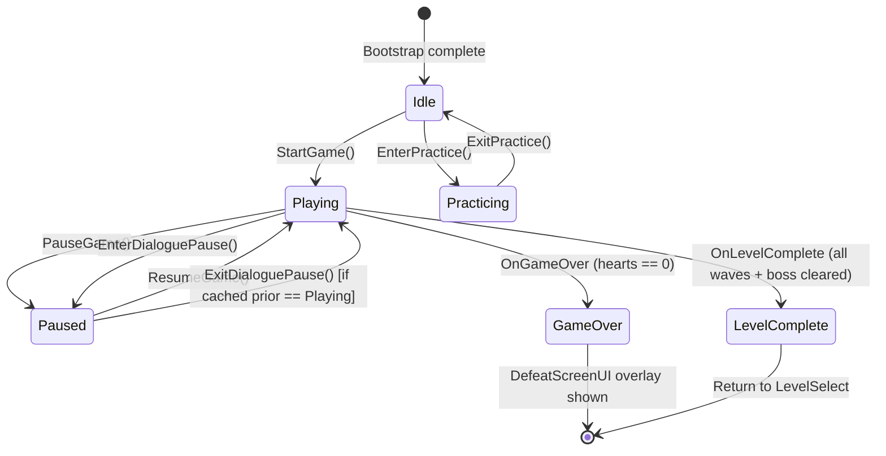
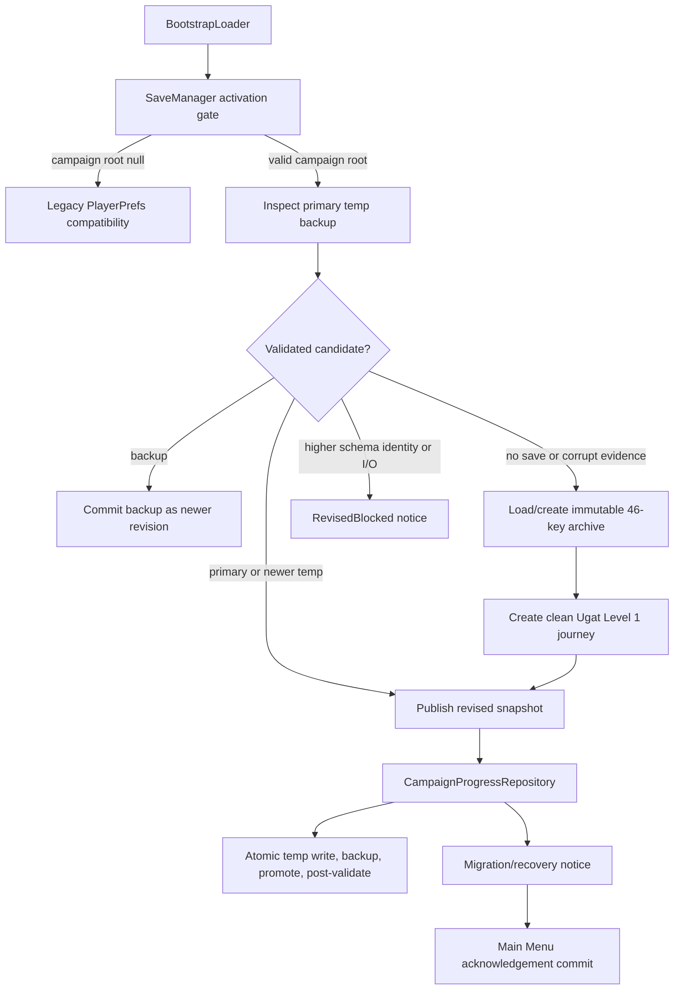
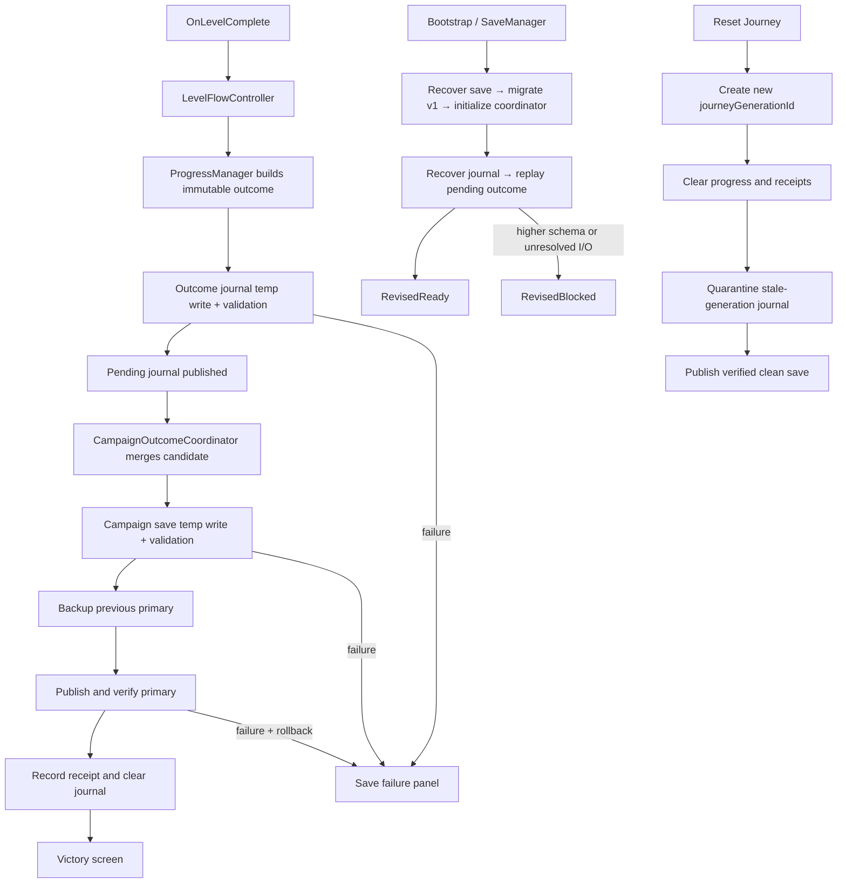

# System Diagrams — Salinlahi

**Purpose:** Defense-ready data and architecture diagrams in place of a traditional ERD.
Salinlahi has no database; persistent content lives in ScriptableObject (SO) assets and runtime
state lives in singletons that communicate over a static EventBus. The four diagrams below
collectively cover the same ground an ERD + class diagram + sequence/flow diagram would for a
database-backed system.

| # | Diagram | ERD/DB Equivalent |
|---|---------|-------------------|
| 1 | ScriptableObject Relationship Diagram | Entity-Relationship Diagram (tables ↔ SO assets) |
| 2 | Class / Component Diagram | Logical Data Model + class structure |
| 3 | Runtime Data Flow Diagram | Sequence / data-flow diagram |
| 4 | State Diagrams | Process / state-transition diagram |

All diagrams use [Mermaid](https://mermaid.js.org/) and render natively in GitHub, VS Code
(with the "Markdown Preview Mermaid Support" extension), and at [mermaid.live](https://mermaid.live)
for PNG/SVG export.

---

## 1. ScriptableObject Relationship Diagram (ERD-equivalent)

Each "entity" is an SO asset type (a content table). Relationships are inspector-assigned
references between assets. This is the closest analogue to a relational ERD for Salinlahi.

```mermaid
erDiagram
    CampaignConfigSO ||--|| CampaignIdentityManifest : "manifest"
    CampaignConfigSO ||--|| CampaignTuning : "tuning"
    CampaignConfigSO ||--|{ EraConfigSO : "3 ordered eras"
    CampaignConfigSO ||--|{ BaybayinCharacterSO : "17 canonical symbols"
    EraConfigSO ||--|{ LevelConfigSO : "5 ordered levels"
    LevelConfigSO ||--|{ FocusWordDefinition : "2 inline focus slots"
    FocusWordDefinition ||--|{ SymbolValueReference : "ordered decomposition"
    SymbolValueReference }o--|| BaybayinCharacterSO : "visual symbol"
    SymbolValueReference }o--|| SpokenValueDefinition : "contextual value ID"
    BaybayinCharacterSO }o--|| LevelConfigSO : "first introduction level"

    LevelConfigSO ||--o{ WaveDefinition : "waves (embedded list)"
    LevelConfigSO ||--|{ BaybayinCharacterSO : "allowedCharacters"
    LevelConfigSO ||--o{ EnemyDataSO : "allowedEnemyTypes"
    LevelConfigSO }o--|| EraThemeSO : "eraTheme"
    LevelConfigSO |o--o| BossConfigSO : "bossConfig (optional)"
    LevelConfigSO |o--o| ChallengeSequenceSO : "optional opt-in sequence"
    EraConfigSO ||--o{ LevelConfigSO : "levels (ordered list)"

    WaveDefinition ||--|{ BaybayinCharacterSO : "characters (subset)"
    WaveDefinition ||--o{ EnemyDataSO : "enemyTypes (subset)"

    EnemyDataSO ||--|| BaybayinCharacterSO : "assignedCharacter"
    EnemyDataSO |o--o| BaybayinCharacterSO : "postHurtCharacter (optional)"

    BossConfigSO ||--|{ BossPhase : "phases (embedded, 1 per HP)"
    BossConfigSO ||--|| EnemyDataSO : "bossEnemyData"
    BossConfigSO ||--o{ EnemyDataSO : "fallbackEnemyTypes"
    BossConfigSO |o--o| BossAudioBankSO : "audioBank (optional)"

    BossPhase ||--o{ EnemyDataSO : "summonEnemyTypes"

    CharacterRegistrySO ||--|{ BaybayinCharacterSO : "All (master registry)"

    AlmanacEnemyRegistrySO ||--|{ AlmanacEnemyEntry : "entries"
    AlmanacEnemyEntry }o--|| EnemyDataSO : "enemyData"
    AlmanacEnemyEntry |o--o| BossConfigSO : "bossConfig (optional; IsBoss = true when set)"

    EnemyGlyphBadge }o--|| GlyphBadgeConfigSO : "config"

    GlyphBadgeConfigSO {
        Vector2 defaultWorldOffset
        float defaultWorldScale
        float swapOutDuration
        float swapInDuration
    }

    CampaignConfigSO {
        CampaignIdentityManifest manifest
        CampaignTuning tuning
        List_BaybayinCharacterSO symbols
        List_EraConfigSO eras
    }

    CampaignIdentityManifest {
        int identityManifestVersion
        string campaignId PK
        int contentSchemaVersion
        int saveSchemaVersion
        string migrationId
        string startingLevelId
    }

    CampaignTuning {
        int defaultShrineHearts
    }

    BaybayinCharacterSO {
        string stableId PK
        string characterID PK
        string syllable
        List_SpokenValueDefinition spokenValues
        string firstIntroductionLevelId
        Sprite displaySprite
        Sprite almanacSprite
        Sprite badgeSprite
        Sprite scrambledBadgeSprite
        AudioClip pronunciationClip
        string templateFileName
        string description
    }

    EnemyDataSO {
        string enemyID PK
        float moveSpeed
        int maxHealth
        Sprite_array walkFrames
        Era era
        bool isDecoy
        bool dealsContactDamage
        BaybayinCharacterSO assignedCharacter FK
        BaybayinCharacterSO postHurtCharacter FK
        string displayName
        string description
        Sprite portraitSprite
    }

    WaveDefinition {
        bool isIntermissionWave
        int enemyCount
        float spawnInterval
        float waveStartDelay
    }

    LevelConfigSO {
        string levelName
        string stableId PK
        int levelNumber
        int eraLocalOrder
        int chapterNumber
        List_FocusWordDefinition focusWords
        List_SymbolValueReference cumulativeSymbolPool
        List_ContentRequirement learningRequirements
        List_ContentRequirement practiceRequirements
        DefenseRules defenseRules
        ContentMediaReferences contextMedia
        List_string rewardIds
        bool challengePrototypeEnabled
        ChallengeSequenceSO challengeSequence FK
        bool isAvailableInLite
        Sprite numberSprite
        List_EnemyDataSO allowedEnemyTypes FK
    }

    EraConfigSO {
        string stableId PK
        int order
        string eraName
        Sprite backgroundSprite
        Sprite bannerSprite
    }

    FocusWordDefinition {
        string stableId PK
        string latinSpelling
        string displayLabel
        List_SymbolValueReference decomposition
    }

    SymbolValueReference {
        BaybayinCharacterSO symbol FK
        string spokenValueId
    }

    SpokenValueDefinition {
        string stableId PK
        string displayValue
        AudioClip pronunciationClip
    }

    ContentRequirement {
        ContentRequirementKind kind
        SymbolValueReference symbolValue
        int requiredSuccesses
    }

    DefenseRules {
        int shrineHearts
        bool focusModeEnabled
        bool multiKillChainEnabled
    }

    ContentMediaReferences {
        Sprite contextImage
        AudioClip narrationClip
        DialogueSO dialogue FK
        CutsceneSO cutscene FK
    }

    BossConfigSO {
        string bossID PK
        string bossName
        string description
        Sprite bossSprite
        float introDuration
        float outroDuration
        Vector2 summonHorizontalBounds
        BossAudioBankSO audioBank FK
    }

    BossAudioBankSO {
        AudioClip bgm
        AudioClip introGrowl
        AudioClip summonTick
        AudioClip bodyFall
        AudioClip vulnerabilityExpiredLaugh
        AudioClip defeat
        AudioClip_array hitGrowls
        AudioClip_array damagedGrowls
        AudioClip_array footsteps
        AudioClip_array teleports
        float footstepInterval
        float bgmFadeInSeconds
        float bgmFadeOutSeconds
    }

    BossPhase {
        float summonPhaseDuration
        float delayBetweenSummons
        int minionsPerSummonMin
        int minionsPerSummonMax
        float delayBetweenMinions
        int requiredCharacterCount
        float vulnerabilityTimer
        BossMovementPattern movementPattern
    }

    EraThemeSO {
        string eraName PK
        Sprite backgroundSprite
        Sprite groundSprite
        Sprite shrineSprite
        Sprite baseZoneSprite
    }

    RecognitionConfigSO {
        int resamplePointCount
        float minimumConfidence
        float multiStrokeWindowSeconds
        float rawSampleMinDistancePixels
        float visualSampleSpacingPixels
        int maxVisualSamplesPerSegment
        float minimumStrokePathLengthPixels
        float minimumStrokeBoundsPixels
    }

    GameConfigSO {
        int focusModeThreshold
        float focusModeDuration
        float focusModeSpeedMultiplier
    }

    CharacterRegistrySO {
        string assetName PK
    }

    AlmanacEnemyRegistrySO {
        string assetName PK
    }

    AlmanacEnemyEntry {
        bool IsBoss
        string ResolveDisplayName
        string ResolveDescription
        Sprite ResolvePortrait
    }
```



**Reading the diagram:**

- `||--o{` = one-to-many (zero or more). A LevelConfigSO has a list of WaveDefinitions (embedded).
- `||--|{` = one-to-many (one or more, required non-empty).
- `}o--||` = many-to-one (a level points to exactly one era theme; many levels can share one).
- `|o--o|` = optional one-to-one (boss config only for boss levels).
- `PK` = primary key (uniquely identifies the asset).
- `FK` = foreign-key-style reference to another SO.

`RecognitionConfigSO` and `GameConfigSO` are singleton tuning assets — no FKs into other SOs,
so they appear standalone.

---

## 2. Class / Component Diagram (UML)

Logical structure of runtime types. Managers inherit from `Singleton<T>`; gameplay components
are MonoBehaviours; `EventBus` is a static façade. SO references from diagram 1 are shown as
dependencies.

```mermaid
classDiagram
    direction LR

    class Singleton~T~ {
        <<abstract>>
        +T Instance
        #virtual Awake()
    }

    class GameManager {
        +GameState CurrentState
        +LevelConfigSO CurrentLevel
        +BossController CurrentBoss
        +StartGame()
        +PauseGame()
        +ResumeGame()
    }
    class SceneLoader {
        +LoadMainMenu()
        +LoadGameplay()
        +LoadLevelSelect()
        +LoadSandboxGameplay()
        +LoadGameOver() <<obsolete>>
        +LoadAlmanac()
    }
    class AudioManager {
        +PlaySFX(AudioClip)
        +PlayBGM(AudioClip)
        +StopBGM()
        +FadeInBGM(AudioClip, float) Coroutine
        +FadeOutBGM(float) Coroutine
    }
    class EnemyPool {
        +Get(EnemyDataSO) Enemy
        -Release(Enemy)
    }
    class RecognitionManager {
        -DollarPRecognizer _recognizer
        -RecognizeStroke(points)
    }
    class ComboManager {
        +int CurrentStreak
    }
    class ActiveEnemyTracker {
        +bool HasActiveNonBossEnemies
        +FindClosestToBase(charID) Enemy
    }
    class CombatResolver {
        +ResolveDraw(charID)
    }

    class EventBus {
        <<static>>
        +OnCharacterRecognized
        +OnEnemyDefeated
        +OnBaseHit
        +OnHeartsChanged
        +OnGameOver
        +OnLevelComplete
        +OnBossDefeated
        +OnBossPhaseStarted
        +OnBossVulnerable
        +OnBossVulnerabilityWindowActive
        +OnBossDamaged
        +OnCharacterUnlocked
    }

    class Enemy {
        -EnemyDataSO _data
        +BaybayinCharacterSO Character
        +EnemyGlyphBadge GlyphBadge
        +Initialize(data, pool)
        +Defeat()
        +ReturnToPool()
    }
    class EnemyGlyphBadge {
        +Refresh()
        +PlaySwap(next)
        +PlayFinalDraw()
        +Show()
        +Hide()
    }
    class EnemyMover {
        -float _speed
        +SetSpeed(float)
        +Stop()
    }
    class BossEnemy {
        +TakeDamage()
        +PlayDeathAnimationFrames()
    }
    class BossController {
        +BossConfigSO Config
        +int CurrentPhaseIndex
        +int HPRemaining
        +bool IsTargetable
        +StartBoss(config, spawner)
        +TryRouteDraw(charID) BossRouteResult
    }
    class BossGlyphVisibilityBinder {
        +HandleVulnerabilityActive()
        +HandleDrawnThisPhaseChanged()
    }
    class BossDrawCounterUI {
        +RefreshFromBoss()
    }
    class GlyphBadgeConfigSO
    class BossSummonTicker
    class BossStateVisuals
    class PhaseBasedMovement
    class BossAudio {
        +HandleBossStarted(BossConfigSO)
        +HandleBossPhaseStarted(int)
        +HandleBossSummonTick()
        +HandleBossTeleport()
        +HandleBossExhausted(int)
        +HandleBossDrawHit()
        +HandleBossDamaged(int, int)
        +HandleBossVulnerabilityExpired(int)
        +HandleBossDefeated()
    }
    class BossAudioBankSO
    class WaveManager {
        +StartLevel(LevelConfigSO)
    }
    class WaveSpawner {
        +Spawn(EnemyDataSO, position)
    }
    class LevelFlowController {
        -LevelConfigSO _level
        -RevealTiming _revealTiming
        +RunLevel()
        -PlayRevealsIfAny() Coroutine
    }
    class SaveManager {
        +SaveManagerMode Mode
        +CampaignProgressRepository Repository
        +CampaignOutcomeCoordinator OutcomeCoordinator
        +RetryPendingOutcome() CampaignOutcomeCommitResult
        +ResetJourneyAtomically() CampaignOutcomeCommitResult
    }
    class ProgressManager {
        +CommitCurrentLevelOutcome() CampaignOutcomeCommitResult
        +RetryPendingLevelOutcome() CampaignOutcomeCommitResult
    }
    class CampaignProgressRepository {
        +string CurrentJourneyGenerationId
        +TrySetActiveLevel(levelId) bool
    }
    class CampaignOutcomeCoordinator {
        +TryCommit(outcome) CampaignOutcomeCommitResult
        +ReplayPendingOnStartup() CampaignOutcomeCommitResult
        +TryResetJourney() CampaignOutcomeCommitResult
    }
    class CampaignOutcomeJournal {
        +TryPersist(outcome, current)
        +TryLoadRecoverable(current)
        +Clear() bool
    }
    class CampaignOutcomeSaveFailurePanel {
        +Present(result, retry, accepted, mainMenu)
        +Hide()
    }
    class CampaignProgressOutcome {
        +string outcomeId
        +string journeyGenerationId
        +string levelId
        +int stars
    }
    class CharacterUnlockRevealController {
        +BuildRevealQueue(allowed, isUnlocked)$ List
        +Play(toReveal) Coroutine
    }
    class HeartSystem {
        +int CurrentHearts
    }
    class DrawingCanvas {
        +OnDrawingStarted
        +OnStrokeCompleted(points)
    }
    class DollarPRecognizer {
        +Recognize(points) RecognitionResult
    }

    class CharacterUnlockProgress {
        <<static>>
        +HasUnlocked(BaybayinCharacterSO) bool
        +TryMarkUnlocked(BaybayinCharacterSO, out string) bool
        +ClearAllUnlocked()
    }
    class AlmanacController {
        +ShowCharacters()
        +ShowEnemies()
        +HandleCharacterUnlocked(BaybayinCharacterSO)
        +CountUnlockedCharacters(list) int
        +CountDiscoveredEnemies(list, predicate) int
        +IsSpanishEra(EnemyDataSO) bool
        +FormatCounter(string, int, int) string
    }
    class AlmanacCell {
        +Setup(Sprite, bool, bool, Action)
        +ShouldShowBossBorder(bool, bool) bool
        +ShouldBeInteractable(bool) bool
    }
    class AlmanacDetailScroll {
        +Show(Sprite, string, string)
        +Hide()
    }
    class AlmanacEnemyDiscovery {
        <<static>>
        +IsDiscovered(EnemyDataSO) bool
    }

    Singleton <|-- GameManager
    Singleton <|-- SceneLoader
    Singleton <|-- AudioManager
    Singleton <|-- EnemyPool
    Singleton <|-- RecognitionManager
    Singleton <|-- ComboManager
    Singleton <|-- ActiveEnemyTracker
    Singleton <|-- CombatResolver
    Singleton <|-- SaveManager
    Singleton <|-- ProgressManager

    Enemy --> EnemyMover : requires
    Enemy --> EnemyGlyphBadge : child
    Enemy ..> EnemyDataSO : uses
    EnemyGlyphBadge ..> GlyphBadgeConfigSO : reads
    BossEnemy --|> Enemy
    BossEnemy --> EnemyGlyphBadge : child
    BossController --> BossEnemy : requires
    BossGlyphVisibilityBinder --> EnemyGlyphBadge : drives
    BossGlyphVisibilityBinder ..> EventBus : subscribes
    BossDrawCounterUI ..> EnemyGlyphBadge : anchors UI
    BossController --> BossSummonTicker : uses
    BossController --> BossStateVisuals : uses
    BossController --> PhaseBasedMovement : uses
    BossController ..> BossConfigSO : uses
    BossController ..> WaveSpawner : uses

    LevelFlowController ..> LevelConfigSO : reads
    LevelFlowController --> WaveManager : drives
    LevelFlowController --> BossController : activates
    LevelFlowController --> CharacterUnlockRevealController : yields Play()
    LevelFlowController --> ProgressManager : commits outcome
    LevelFlowController --> CampaignOutcomeSaveFailurePanel : gates Victory
    ProgressManager --> SaveManager : asks for coordinator
    SaveManager --> CampaignProgressRepository : exposes
    SaveManager --> CampaignOutcomeCoordinator : initializes/replays
    CampaignOutcomeCoordinator --> CampaignOutcomeJournal : journals
    CampaignOutcomeCoordinator --> CampaignProgressRepository : publishes monotonic state
    CampaignOutcomeCoordinator ..> CampaignProgressOutcome : validates/applies

    CharacterUnlockRevealController --> AlmanacDetailScroll : shows
    CharacterUnlockRevealController ..> CharacterUnlockProgress : TryMarkUnlocked
    CharacterUnlockRevealController ..> EventBus : RaiseCharacterUnlocked
    CharacterUnlockRevealController ..> GameManager : SuppressDrawingInput

    WaveManager ..> WaveDefinition : reads
    WaveManager --> EnemyPool : gets enemies from
    WaveManager --> WaveSpawner : uses

    RecognitionManager --> DollarPRecognizer : uses
    RecognitionManager ..> RecognitionConfigSO : reads
    DrawingCanvas --> RecognitionManager : forwards strokes
    CombatResolver --> ActiveEnemyTracker : queries

    AudioManager ..> EventBus : subscribes
    GameManager ..> EventBus : subscribes
    HeartSystem ..> EventBus : sub + pub
    WaveManager ..> EventBus : publishes
    BossController ..> EventBus : publishes
    Enemy ..> EventBus : publishes
    EnemyMover ..> EventBus : publishes
    BossAudio --> BossController : requires
    BossAudio ..> EventBus : subscribes
    BossAudio ..> AudioManager : PlaySFX / FadeInBGM / FadeOutBGM
    BossAudio ..> BossAudioBankSO : reads
    BossController ..> BossConfigSO : uses

    AlmanacController ..> CharacterUnlockProgress : reads
    AlmanacController ..> AlmanacEnemyDiscovery : reads
    AlmanacController ..> EventBus : subscribes OnCharacterUnlocked
    AlmanacController --> AlmanacCell : creates
    AlmanacController --> AlmanacDetailScroll : drives
    AlmanacCell ..> EventBus : no subscription (UI only)
```



**Notation:**

- Solid arrow `-->` = strong dependency (composition / required component).
- Dashed arrow `..>` = uses / reads (data dependency or pub-sub).
- Triangle `<|--` = inheritance.
- `<<abstract>>` / `<<static>>` = stereotype.

---

## 3. Runtime Data Flow Diagram

How data moves through the system during a single round of gameplay. SOs on the left feed
runtime systems in the middle; EventBus is the central hub; consumers on the right react.

```mermaid
flowchart LR
    subgraph SO_Assets["Content (ScriptableObjects)"]
        CCfg["CampaignConfigSO"]
        CIM["CampaignIdentityManifest"]
        CT["CampaignTuning"]
        LC["LevelConfigSO"]
        EW["FocusWordDefinition (inline x2)"]
        SVR["SymbolValueReference"]
        SVD["SpokenValueDefinition"]
        WC["WaveDefinition (embedded)"]
        ED["EnemyDataSO"]
        BC["BaybayinCharacterSO"]
        BCfg["BossConfigSO"]
        GBCfg["GlyphBadgeConfigSO"]
        RC["RecognitionConfigSO"]
        CS["ChallengeSequenceSO"]
    end

    CV["CampaignConfigValidator"]
    CSV["ChallengeSequenceValidator"]
    LK["Stable-ID lookup"]
    CCfg --> CIM
    CCfg --> CT
    CCfg --> CV
    CV -- "valid manifest, topology, and introduction pools" --> LK
    LC --> CS
    CV -- "when challenge opt-in is enabled" --> CSV
    CSV --> CS
    LK --> LC
    CCfg --> LC
    LC --> EW
    EW --> SVR
    SVR --> BC
    SVR --> SVD

    subgraph Input["Player Input"]
        T["EnhancedTouch history"]
        SC["StrokeCapture"]
        DC["DrawingCanvas"]
        T --> SC
        SC -- "visual-only curve" --> DC
    end

    subgraph Recognition["Recognition Pipeline"]
        RM["RecognitionManager"]
        DP["$P (DollarPRecognizer)"]
        SC -- "raw stroke points" --> RM
        RM --> DP
        DP -- "score >= 0.60" --> RM
        RC -. "threshold, resample" .-> RM
        RC -. "sampling, tap rejection" .-> SC
    end

    subgraph FlowCtrl["Level Flow"]
        LFC["LevelFlowController"]
        WM["WaveManager"]
        BCtl["BossController"]
        CUR["CharacterUnlockRevealController"]
        LC -. "config" .-> LFC
        LFC --> WM
        LFC -- "if boss level" --> BCtl
        LFC -- "PlayRevealsIfAny()" --> CUR
        WC -. "config" .-> WM
        BCfg -. "config" .-> BCtl
    end

    subgraph Persistence["Atomic Progress Outcome"]
        PM["ProgressManager"]
        OJ["CampaignOutcomeJournal"]
        OC["CampaignOutcomeCoordinator"]
        CSS["CampaignSaveService"]
        SFP["CampaignOutcomeSaveFailurePanel"]
        LFC --> PM
        PM --> OJ
        OJ --> OC
        OC --> CSS
        LFC -->|"PendingRetry / Rejected / Blocked"| SFP
    end

    subgraph Spawning["Enemy Spawning"]
        EP["EnemyPool"]
        WS["WaveSpawner"]
        WM --> WS
        BCtl --> WS
        WS --> EP
        ED -. "type data" .-> EP
        EP -- "Get(data)" --> EN["Enemy / BossEnemy"]
        BC -. "carried glyph" .-> EN
    end

    subgraph EB["Event Bus (static)"]
        E1(["OnCharacterRecognized"])
        E2(["OnEnemyDefeated"])
        E3(["OnBaseHit"])
        E4(["OnHeartsChanged"])
        E5(["OnGameOver"])
        E6(["OnBossDamaged / Defeated"])
        E7(["OnCharacterUnlocked"])
    end

    subgraph Almanac["Almanac Scene"]
        AC["AlmanacController"]
        ACL["AlmanacCell (grid)"]
        ADS["AlmanacDetailScroll (overlay)"]
        CUP["CharacterUnlockProgress (static)"]
        AED["AlmanacEnemyDiscovery (static seam)"]
        AC --> ACL
        AC --> ADS
        AC ..> CUP
        AC ..> AED
    end

    RM -- "raise" --> E1
    E1 --> CR["CombatResolver"]
    E1 --> BCtl
    CR -- "matched enemy" --> EN
    BCtl -- "TryRouteDraw" --> BCtl
        EN -- "Defeat()" --> E2
        EGB["EnemyGlyphBadge"]
        BGB["BossGlyphVisibilityBinder"]
        BCfg -. "config" .-> BGB
        GBCfg -. "tuning" .-> EGB
        EN --> EGB
        BCtl --> BGB
        BGB --> EGB
        E2 --> AM["AudioManager"]
    E2 --> CM["ComboManager"]
    EN -- "reaches base" --> E3
    E3 --> HS["HeartSystem"]
    HS --> E4
    E4 --> HUD["Heart HUD"]
    HS -- "hearts == 0" --> E5
    E5 --> GM["GameManager"]
    GM --> DSU["DefeatScreenUI overlay"]
    CSS -->|"verified campaign snapshot"| OC
    OC -->|"Committed / AlreadyCommitted"| VSU["VictoryScreenUI"]
    BCtl --> E6
    E6 --> HUD2["Boss HUD"]
    CUR -- "raise (per acknowledged reveal)" --> E7
    E7 --> AC
```

**Reading the diagram:**

- Solid edges = data passed at runtime (method calls, event payloads).
- Dashed edges = inspector-assigned configuration read at load time.
- Rounded nodes inside *Event Bus* are events, not classes.

---

## 4. State Diagrams

Two state machines run during gameplay. The outer one is the global `GameState`; the inner one
is the per-encounter boss phase machine that only runs on boss levels (5, 10, 15).

### 4.1 Global `GameState` (owned by `GameManager`)



### 4.2 Boss Encounter (owned by `BossController`, one cycle per phase / HP point)

```mermaid
stateDiagram-v2
    [*] --> Idle
    Idle --> Intro : StartBoss(config)
    Intro --> SummoningPhase : after introDuration

    SummoningPhase --> WindingDown : after summonPhaseDuration (gate; in-flight acts complete)
    note right of SummoningPhase
        Streams minions on delayBetweenMinions cadence within each act.
        Acts repeat every delayBetweenSummons. Movement pattern fires between acts.
    end note

    WindingDown --> Vulnerable : all non-boss enemies cleared
    note right of WindingDown
        Boss starts panting animation.
        Waits for active enemy list to drain.
    end note

    Vulnerable --> Damaged : player draws required N glyphs in time
    Vulnerable --> SummoningPhase : vulnerabilityTimer expired

    Damaged --> SummoningPhase : HP remaining > 0, next phase
    Damaged --> Outro : HP == 0 (final phase cleared)

    Outro --> Defeated : after outroDuration + death frames
    Defeated --> [*] : RaiseBossDefeated → RaiseLevelComplete
```

**Notes on the boss machine:**

- One full Summoning → WindingDown → Vulnerable → Damaged loop = one HP point.
- HP = `phases.Count` from `BossConfigSO`; there is no separate `maxHealth` field.
- `Vulnerable → SummoningPhase` is the "missed window" branch: player failed to draw the
  required glyph count within `vulnerabilityTimer`, so the phase repeats without HP loss.
- Damage is only applied via `BossController.TryRouteDraw` during the Vulnerable window;
  `BossEnemy.TakeDamage` is a no-op so the normal enemy hit path cannot kill the boss.

---

## Appendix A — Exporting to Slides

To embed these diagrams in defense slides:

1. Open this file in VS Code with the "Markdown Preview Mermaid Support" extension, or push to
   GitHub and view in the browser. Both render the diagrams live.
2. For static export, paste any single ```` ```mermaid ```` block into <https://mermaid.live>
   and use *Actions → Download PNG / SVG*.
3. SVG is preferred for slides — it scales without pixelation on projectors.

## Appendix B — When to Update This Document

Update this file whenever any of the following change:

- A new SO type is added under `Assets/Scripts/Data/`.
- A new `Singleton<T>` subclass is added under `Assets/Scripts/Core/`.
- A new event is added to `EventBus.cs`.
- The boss state machine in `BossController.cs` gains or removes a state.

Treat it as a living artifact alongside `docs/system/05_Data_Contracts_and_ScriptableObjects.md`.

## 5. Campaign Save and Migration Flow (SALIN-171)



The revised branch has one persistence writer: the repository commit boundary. Audio volume
continues through the legacy PlayerPrefs audio adapter and is intentionally absent from the JSON
campaign document.

## 6. Atomic Progress Outcome Flow (SALIN-174)



The completion branch cannot reach Victory until the receipt and published campaign snapshot have
been verified. Startup replay uses the durable journal payload rather than a runtime callback.
Reset generation mismatch makes an older pending outcome stale, so it cannot restore progress from
the previous journey.
